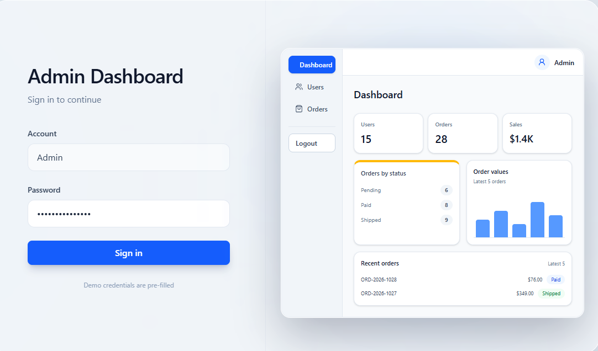

# Admin Dashboard

Admin dashboard built with Next.js, TypeScript, Prisma and PostgreSQL.

**Live demo:** https://admin-dashboard-m-amroune.vercel.app/login

<p align="center">
  
</p>

## About the Project

### Objective

Build an admin dashboard to manage users and orders through a simple data-driven interface.

The project focuses on:

* Clear feature separation
* Realistic admin workflows
* Server-side data with Prisma and PostgreSQL
* Maintainable structure
* Automated testing of key behaviors

The authentication system is intentionally simplified for demonstration purposes and is not intended for production use.

---

## Project Overview

The dashboard includes the following modules:

* **Dashboard**
  Overview of total users, total orders and order distribution by status.

* **Authentication**
  Login page with a cookie-based demo session, protected dashboard routes and logout.

* **Users Management**
  Users list, user creation, deletion and role management between `user` and `admin`.

* **Orders Management**
  Orders list, individual order detail pages and status updates through the `pending`, `paid` and `shipped` workflow.

* **Health Check**
  API endpoint that checks the PostgreSQL database connection.


---

## Built With


---

## Features

- Protected dashboard routes
- Shared dashboard layout with sidebar navigation
- Users CRUD operations
- - Orders listing, detail view and status updates

---

## Installation

```bash
git clone https://github.com/m-amroune/admin-dashboard.git
cd admin-dashboard
npm install
npm run dev

```
